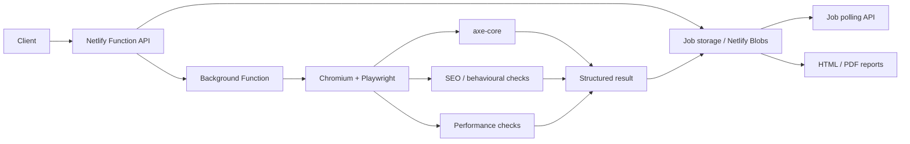

# Accessibility Scanner Cloud

[](https://github.com/cirochiado/accessibility-scanner-cloud/actions/workflows/ci.yml)

A serverless website-analysis project focused on **accessibility, technical SEO and performance checks**.

The project was built as a cloud evolution of a locally validated scanner, with asynchronous jobs, browser-based analysis, structured results and downloadable reports.

## Quick review

If you are reviewing this repository, these files show the main parts of the implementation:

- [Accessibility scan engine](./_src/cloud-scan.mjs)
- [Behavioural checks](./_src/behavior.mjs)
- [Security / SSRF protections](./_src/security.mjs)
- [Authentication](./_src/auth.mjs)
- [SEO scanner](./_src/seo-scan.mjs)
- [Performance scanner](./_src/performance-scan.mjs)
- [Netlify serverless functions](./netlify/functions)
- [Automated tests](./test)
- [CI workflow](./.github/workflows/ci.yml)

## Architecture



## What it does

The scanner can analyse a single URL or crawl multiple pages and produce structured results for:

- accessibility issues
- technical SEO checks
- page metadata and crawl signals
- browser-based behavioural checks
- internal performance metrics
- HTML / PDF reporting

## Tech stack

- Node.js 22+
- JavaScript / ES modules
- Netlify Functions
- Netlify Background Functions
- Netlify Blobs
- Playwright Core
- Chromium
- @axe-core/playwright

## Accessibility API

- `POST /api/v1/scans` — creates a scan job
- background worker — runs Chromium, axe and behavioural checks
- `GET /api/v1/jobs/:id` — job polling
- structured output contract: `wdc013.a11y-result.v1`

## SEO API

A separate SEO pipeline uses the `wdc014.seo-result.v1` contract and keeps its crawl history and reports isolated from the accessibility workflow.

## Performance API

- `POST /api/v1/performance`
- structured output contract: `wdc018.performance-result.v1`

The performance scan collects signals including TTFB, FCP, LCP, CLS, long-task blocking, load time, resource count and transfer size.

## Security

The project includes several controls designed for safe server-side browser automation:

- Bearer-token authentication for scan and polling APIs
- separate random access keys for reports
- private IP / URL blocking
- browser-request filtering to reduce SSRF risk
- isolated job and report storage

## Automated validation

Every push to `main` and every pull request runs a public GitHub Actions CI workflow that:

1. installs the project dependencies on Node.js 22
2. runs the automated test suite
3. performs syntax checks across the scanner modules and Netlify functions

Local validation uses the same commands:

```bash
npm install
npm test
npm run check
```

## Validation approach

Cloud deployments are regression-tested against the previously validated local implementation.

The goal is not pixel-identical browser output across environments, but consistent detection of the main rule families, behavioural signals and technical issues.

## Project status

Current public repository version: **v0.7.x**

The repository contains the Netlify cloud implementation and related documentation for accessibility, SEO and performance scanning.

## Related work

This project is part of a broader set of web-quality and automation tools I have been developing around website auditing, accessibility, SEO, performance and digital operations.

- Portfolio: https://webdeveloperciro.com
- GitHub evidence overview: https://github.com/cirochiado/E-portfolio/blob/main/TECHNICAL-EVIDENCE.md
