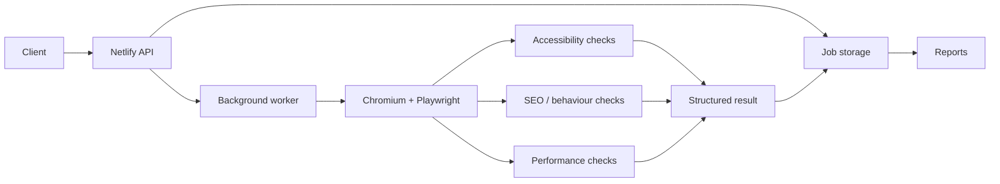

# Accessibility Scanner Cloud

[](https://github.com/cirochiado/accessibility-scanner-cloud/actions/workflows/ci.yml)

A serverless website-analysis project focused on **accessibility, technical SEO and performance checks**.

## Start here

- [Accessibility scan engine](./_src/cloud-scan.mjs)
- [Behavioural checks](./_src/behavior.mjs)
- [Security / SSRF protections](./_src/security.mjs)
- [Authentication](./_src/auth.mjs)
- [SEO scanner](./_src/seo-scan.mjs)
- [Performance scanner](./_src/performance-scan.mjs)
- [Netlify functions](./netlify/functions)
- [Automated tests](./test)
- [CI workflow](./.github/workflows/ci.yml)

## What it does

The scanner can analyse a single URL or crawl multiple pages and produce structured results for:

- accessibility issues
- technical SEO checks
- page metadata and crawl signals
- browser-based behavioural checks
- performance signals
- HTML / PDF reporting

## Tech stack

- Node.js
- JavaScript / ES modules
- Netlify Functions and Background Functions
- Netlify Blobs
- Playwright / Chromium
- axe-core

## Architecture



## Security

The project includes:

- authenticated scan and polling requests
- separate access keys for reports
- private-network and unsafe-URL blocking
- browser-request filtering to reduce SSRF risk
- isolated job and report storage

## Automated validation

GitHub Actions runs the automated test suite and syntax checks on pushes and pull requests.

Local validation uses:

```bash
npm install
npm test
npm run check
```

## Related work

- [Project portfolio](https://github.com/cirochiado/E-portfolio)
- [Web portfolio](https://webdeveloperciro.com)
